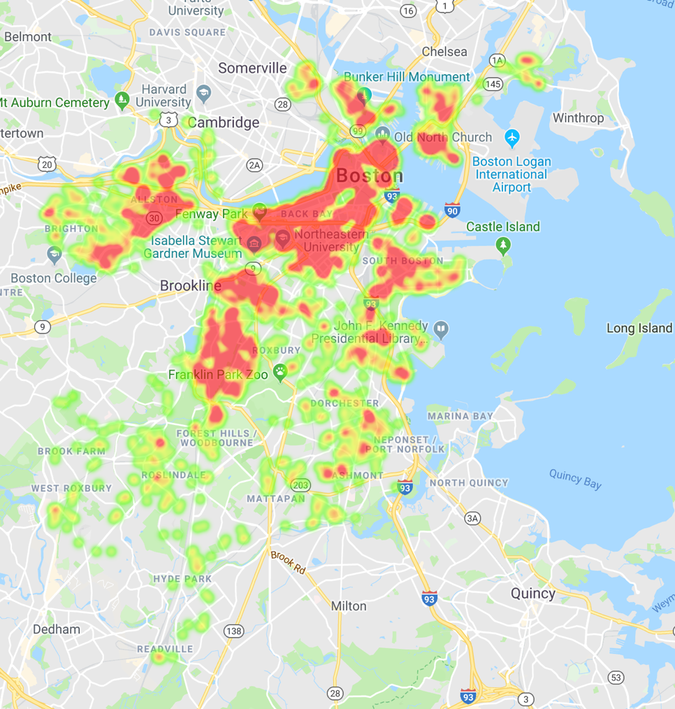
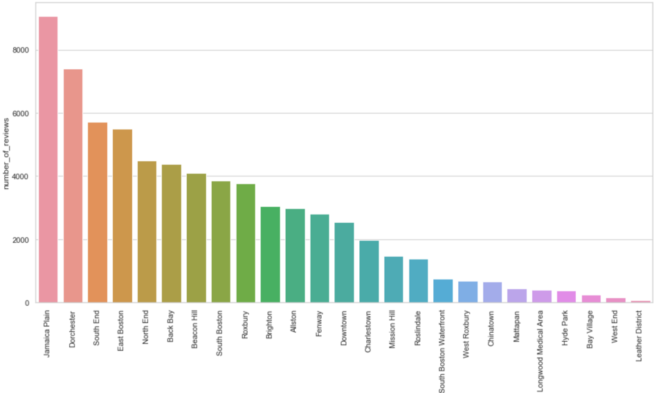
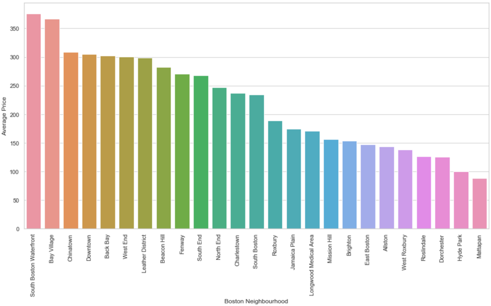
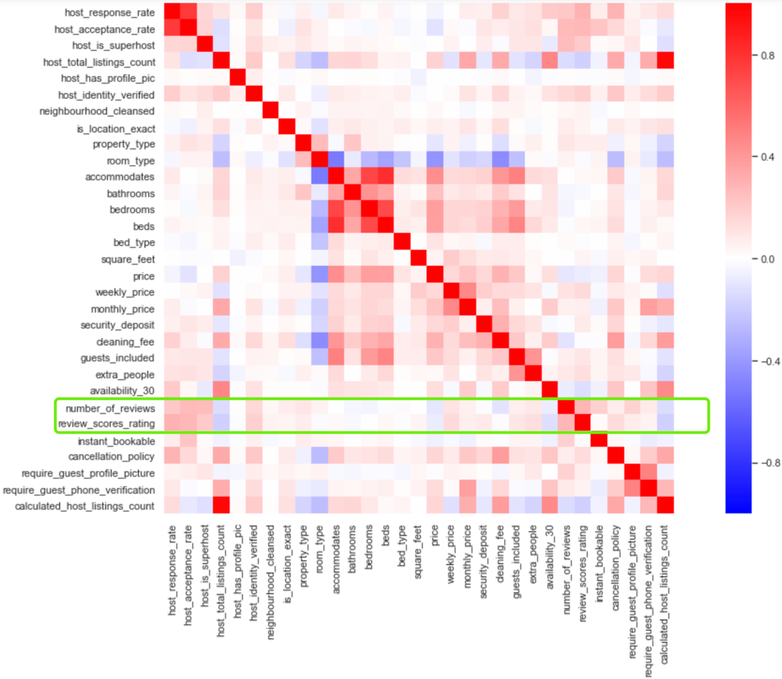

# Boston Airbnb Analysis

## Requirments
- Python 3
- pip install numpy pandas matplotlib seaborn gmplot 

## Project Motivation
For this project, I am interested in using Boston Airbnb data on September 7, 2016 to obtain some information about the popularity of Airbnb in Boston. The following business questions will be addressed:
1.	Which area in Boston is the most popular place in which to live?
2.	What is the average price of a home in each neighborhood in Boston?
3.	What factors will affect the popularity of the Airbnb in Boston?

## File Descriptions
Due to the explosion of the Airbnb short-term rental market in Boston recent years, the city now faces a serious housing shortage in the general rental market. The Walsh administration, therefore, decided last year to enact a new ordinance surrounding short-term rentals to come into effect January 1, 2019. We might wonder why Airbnb has grown so quickly that the government saw a need to enact regulations to restrict and control it? In order to give some insight to this question, we have addressed three business questions about the popularity of Airbnb by analyzing this Boston Airbnb public data which has 3,585 observations and 95 attributes. 

## Dataset
This proejct used the dataset from Kaggle:
https://www.kaggle.com/airbnb/boston

### Data preprocessing

The target features which we concentrate on for evaluating the popularity are `number_of_review` and `review_scores_rating`. The following is what we have done:

1. We have dealt with the null value by dropping null value and fill missing value with zero in `review_scores_rating` and `cleaning_fee` respectively. 
2. We convert the type from string to float in price column.
3. Calculate the total price of house which customers need to pay eventually. We sum the `price` and `cleaning_fee` up as the total price per night.

### Results
1. The following heatmap briefly describe the distribution of Airbnb listed houses in Boston.
   
    

2. The following graph has demonstrated and answered the first business question about the most popular area in Boston which is Jamaica Plain.
    
    

3. According to the following graph, we can observe the distribution of the average price of each neighborhood in Boston
   
    

4. The following heatmap illustrates the factors which affect the popularity of the Airbnb in Boston. In other words, the correlation between the listed features and the number_of_review and review_scores_rating (Focus on the green rectangular in the graph).
   
    

    