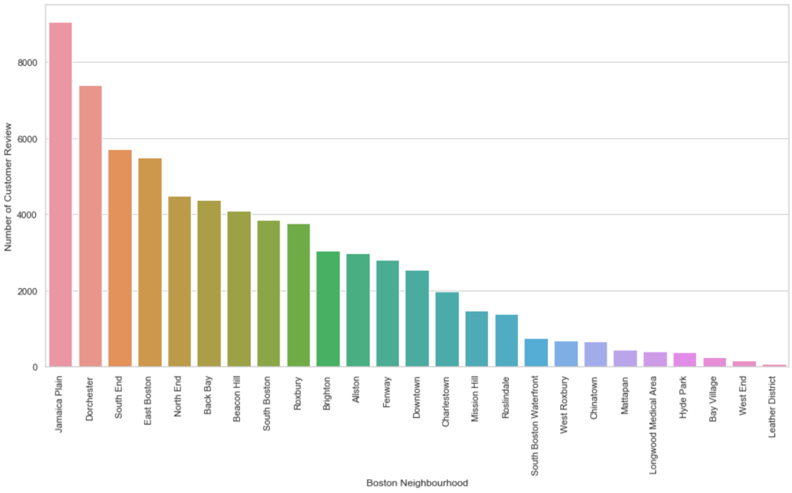

# Boston Airbnb Analysis
Due to the explosion of the Airbnb short-term rental market in Boston recent years, the city now faces a serious housing shortage in the general rental market. The Walsh administration, therefore, decided last year to enact a new ordinance surrounding short-term rentals to come into effect January 1, 2019. We might wonder why Airbnb has grown so quickly that the government saw a need to enact regulations to restrict and control it? In order to give some insight to this question, we have addressed three business questions about the popularity of Airbnb by analyzing this Boston Airbnb public data which has 3,585 observations and 95 attributes. 

## Business quesstions
1.	Which area in Boston is the most popular place in which to live?

2.	What is the average price of a home in each neighborhood in Boston?

3.	What factors will affect the popularity of the Airbnb in Boston?

## Dataset
This proejct used the dataset from Kaggle:
https://www.kaggle.com/airbnb/boston

### Data preprocessing

The target features which we concentrate on for evaluating the popularity are `number_of_review` and `review_scores_rating`. The following is what we have done:

1. We have dealt with the null value by dropping null value and fill missing value with zero in `review_scores_rating` and `cleaning_fee` respectively. 
2. We convert the type from string to float in price column.
3. Calculate the total price of house which customers need to pay eventually. We sum the `price` and `cleaning_fee` up as the total price per night.

### Results
1. Heatmap of the distribution of the Airbnb listing houses in Boston
   
    

2. The most popular area is Jamaica Plain
    
    

3. The average price of each neighborhood in Boston
   
    

4. The factors will affect the popularity of the Airbnb in Boston
   
    

    